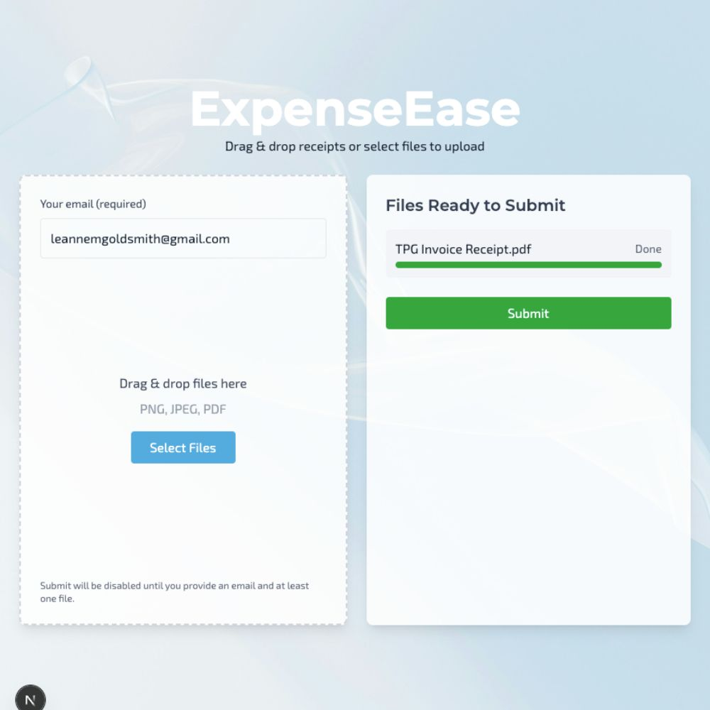
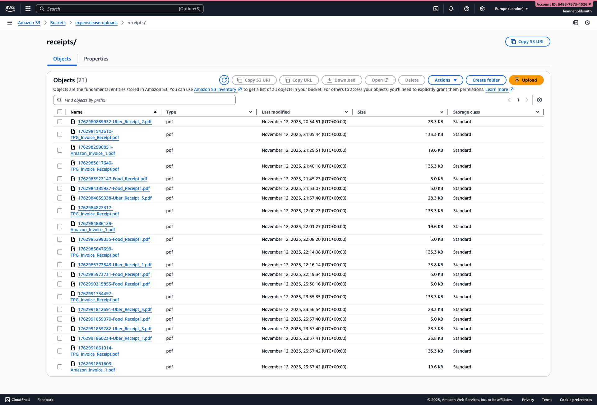
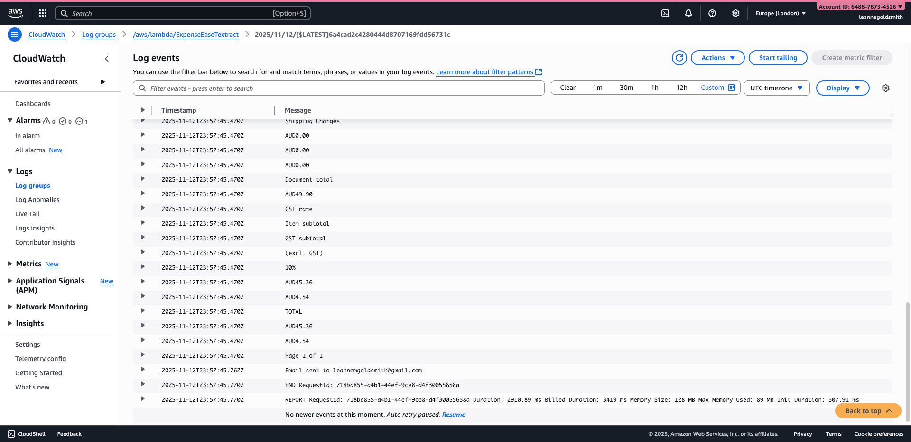
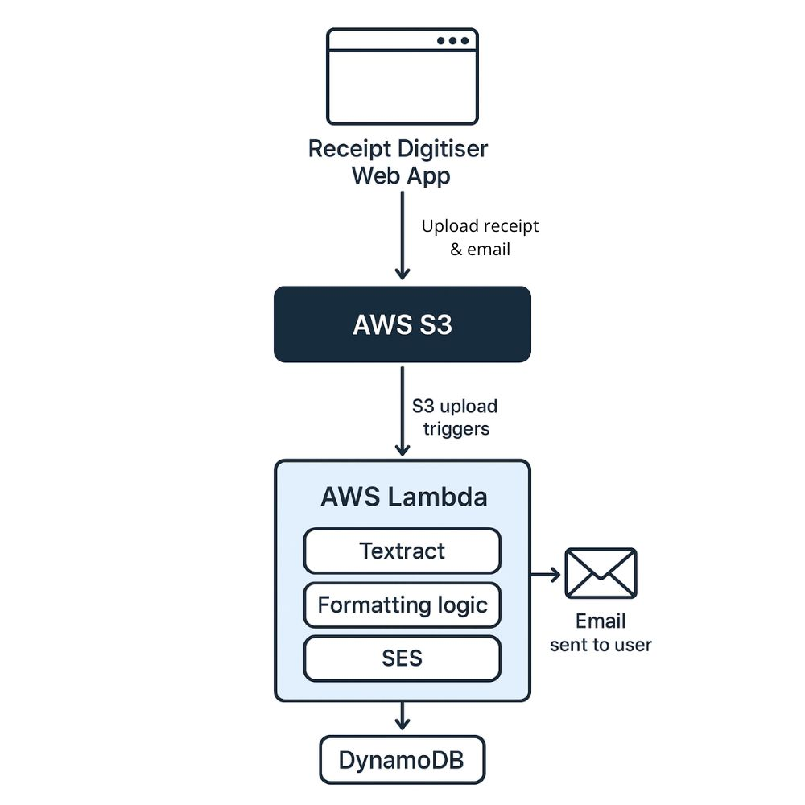

ExpenseEase: A Receipt Digitiser Web App
========================================

Overview
--------

ExpenseEase is a cloud-based application that allows users to submit receipts along with their email address for digitisation. Users enter their email, upload one or more receipts (via drag-and-drop or file selection), and submit the form.

**Important note:** Due to Amazon SES sandbox restrictions, emails are currently sent only to a verified admin email address. The submitted receipts include the user’s email in the metadata, so the admin receives a copy of the receipt along with the user’s email. In a production environment with a verified sending domain and SES production access, the system would be able to deliver digitised receipts directly to any user-provided email.

This setup allows the project to demonstrate the integration between a Next.js front end and AWS services for file storage, text extraction, and email formatting, while maintaining safe testing practices.

Features
--------

*   **User input and file upload:** Users can provide their email and submit receipts via drag-and-drop or file selection.
    
*   **Email validation and file upload requirement:** The "Submit" button is enabled only if a valid email and at least one file are provided.
    
*   **Cloud storage:** Receipts are uploaded to an AWS S3 bucket for storage and processing.
    
*   **Automatic text extraction:** AWS Textract extracts relevant data from uploaded receipts.
    
*   **Formatted email delivery:** AWS Lambda formats extracted data and sends it to a verified admin email via Amazon SES, including the user’s email in the metadata.
    
*   **Front-end usability:** Designed to demonstrate cloud integration without requiring backend knowledge.
    

Screenshots
-----------

**Homepage**

**AWS S3 Bucket**

**AWS CloudWatch**

Tech Stack
----------

*   **Frontend:** Next.js, React, Vercel
    
*   **Backend / Cloud Services:**
    
    *   AWS S3 (receipt storage)
        
    *   AWS Lambda (data formatting)
        
    *   Amazon Textract (text extraction)
        
    *   Amazon SES (email delivery to verified admin email)
        
    *   AWS CloudWatch (logs)
        
*   **Other:** JavaScript, HTML, CSS
    

Architecture Diagram
--------------------

Purpose
-------

This project was developed to demonstrate cloud-based automation and front-end integration for user-friendly receipt digitisation. While emails currently go only to a verified admin address due to SES sandbox limitations, the system showcases a fully interactive front-end that connects to AWS services for storage, text extraction, and formatted email delivery.

What I Learned
--------------

*   Integrating AWS services (S3, Textract, Lambda, SES) with a Next.js front-end.
    
*   Handling file uploads and email validation in a React-based web app.
    
*   Coordinating asynchronous processes between the front end and serverless backend.
    
*   Formatting extracted data dynamically before sending via email.
    
*   Designing a user-friendly interface for non-technical users.
    

Future Development
------------------

*   **User authentication:** Implement login and registration functionality with role-based access (admin vs. regular user).
    
*   **Admin dashboard:** Allow administrators to view all uploaded receipts and manage data stored in a DynamoDB database.
    
*   **User dashboard:** Enable users to view all past and present uploaded receipts from their account.
    
*   **Enhanced receipt processing:** Support additional receipt formats, multi-page receipts, and advanced data validation.
    
*   **Notification system:** Option for real-time updates via email or push notifications.
    
*   **Production email delivery:** With a verified sending domain and SES production access, enable dynamic email delivery to user-provided email addresses.
    

Limitations
-----------

*   **Email delivery restriction:** Currently, emails are sent only to a single verified admin email due to Amazon SES sandbox restrictions. User emails are included in metadata, so the admin receives the receipt and knows which user submitted it.
    
*   **No user authentication:** The application does not yet have login or registration functionality, so users cannot track their receipt history.
    
*   **Single environment testing:** All email-based functionality has been tested using the admin email. Full dynamic email delivery will require domain verification and SES production access.
    

How to Run Locally
------------------

1.  git clone
    
2.  cd receipt-digitiser
    
3.  npm install
    
4.  Set up environment variables for AWS credentials and services.
    
5.  npm run dev
    
6.  Open [http://localhost:3000](http://localhost:3000) in your browser.